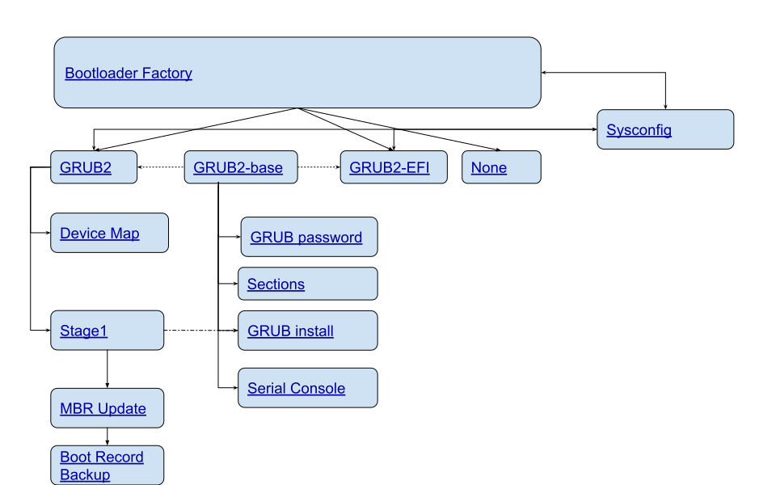

# YaST - The Bootloader Module #

## Goal

This module has two main responsibilities:

1. Proposing bootable configuration so even beginners who never heard about
   booting can get bootable distribution out of box without any interaction.

2. Allow to edit existing configuration or proposal for advanced users which
   already know what they want to achieve.

Check our list of [supported scenarios.](SUPPORTED_SCENARIOS.md)

## Development

### High Level Overview

Bootloader module consist of two more or less separated components. UI including dialogs, widgets and similar and backend that is responsible for reading, writting, proposing.

### Backend

Entry point to backend is [bootloader factory](https://www.rubydoc.info/github/yast/yast-bootloader/master/Bootloader/BootloaderFactory),
that itself hold and also can propose bootloader implementation. So now lets explain each component on image:

- [GRUB2](https://www.rubydoc.info/github/yast/yast-bootloader/master/Bootloader/Grub2) for legacy booting or emulated grub2 boot like s390x.
- [GRUB2-EFI](https://www.rubydoc.info/github/yast/yast-bootloader/master/Bootloader/Grub2EFI) for EFI variant of GRUB2 bootloader
- [None](https://www.rubydoc.info/github/yast/yast-bootloader/master/Bootloader/NoneBootloader) when yast2 does not manage booting
- [GRUB2 base](https://www.rubydoc.info/github/yast/yast-bootloader/master/Bootloader/Grub2Base) is shared functionality for both GRUB2 implementations
- [GRUB password](https://www.rubydoc.info/github/yast/yast-bootloader/master/Bootloader/GRUB2Pwd) is specific class that manage password protection of grub2
- [Sections](https://www.rubydoc.info/github/yast/yast-bootloader/master/Bootloader/Sections) is component responsible for getting info about generated grub2 sections and what is default section for boot
- [GRUB2 install](https://www.rubydoc.info/github/yast/yast-bootloader/master/Bootloader/GrubInstall) is responsible for calling grub2-install script with correct arguments. For legacy booting it gets target stage1 devices.
- [Device Map](https://www.rubydoc.info/github/yast/yast-bootloader/master/Bootloader/DeviceMap) is component responsible for managing mapping between grub device name and kernel/udev name.
- [Stage1](https://www.rubydoc.info/github/yast/yast-bootloader/master/Bootloader/Stage1) holds information about stage1 location for grub2, also if generic MBR is needed and if partition should be activated.
- [MBR Update](https://www.rubydoc.info/github/yast/yast-bootloader/master/Bootloader/MBRUpdate) is responsible for generic MBR and stage1 if needed
- [Boot Record backup](https://www.rubydoc.info/github/yast/yast-bootloader/master/Bootloader/BootRecordBackup) creates backup of boot record for devices which code touches
